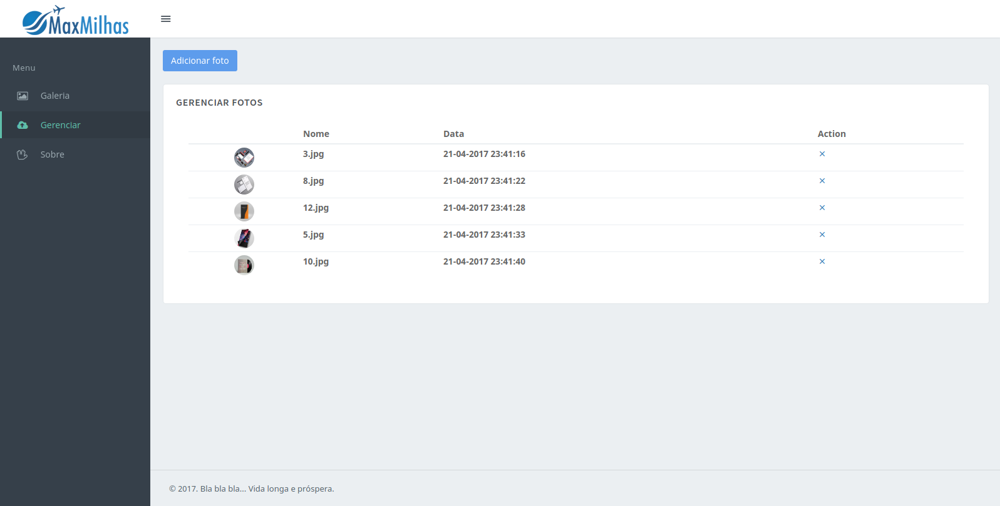
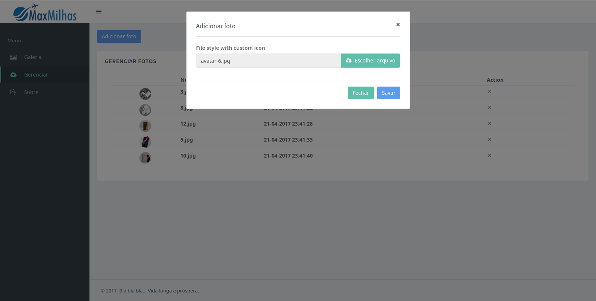

# Gerenciador

### Conteúdo

Esta interface permite o gerenciamento das imagens adicionadas anteriormente, também possibilitando a exclusão e adição de novas imagens como exibido na imagem a seguir.

